# ProyectoFinal DMC - Caso de Estudio N°1

Este caso de estudio se desarrolla como un proyecto aplicado, cuyo entregable principal es una aplicación interactiva 
construida en Python utilizando Streamlit, orientada al Análisis Exploratorio de Datos (EDA) del dataset 
BankMarketing.csv.

# Contexto del Dataset

El archivo input BankMarketing.csv, corresponde a una institución financiera que busca entender los factores que influyen 
en la aceptación de sus campañas de marketing. Durante los últimos 6 meses, la efectividad (e = (Ventas/Base)×100%) cayó 
de 12% a 8%, afectando los bonos de los ejecutivos comerciales.
Dimensiones del dataset (filas, columnas) = (41188, 21)

## Estructura
- app.py
- requirements
- README.md
- Dataset/BankMarketing.csv

## Instrucciones de ejecución
1. Una vez cargada la aplicación, revisar el menú (lado izquierdo).
2. Las opciones de menú son Home: y Carga del dataset.
3. En la carga del dataset, seleccionar el archivo BankMarketing.csv
4. Una vez cargada la vista previa del dataset. visualizar cada uno de los items (tabs).
   
   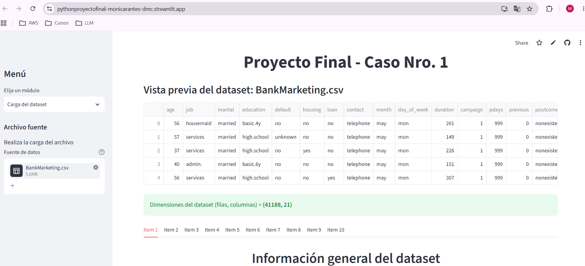

## Funcionalidades
- Carga del Dataset 
- Vista previa del Dataset
- Desarrollo de 10 ítems de análisis:
  - Ítem 1: Información general del dataset

    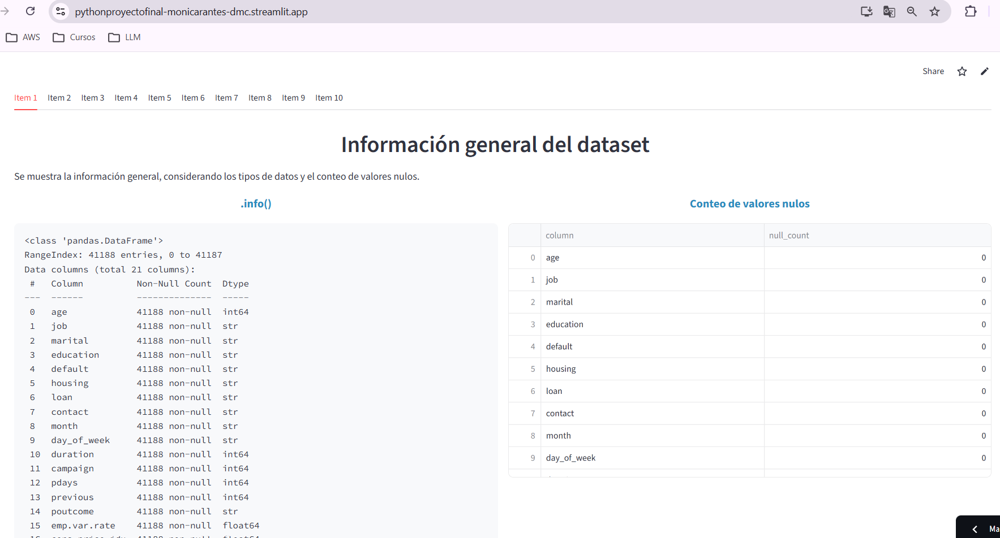  

  - Ítem 2: Clasificación de variables

    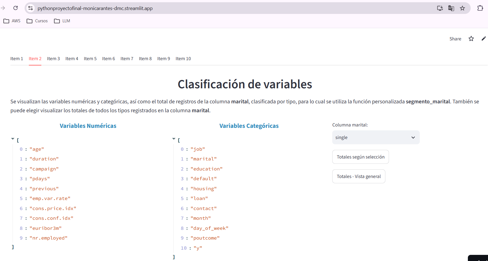

    
  - Ítem 3: Estadísticas descriptivas
 
    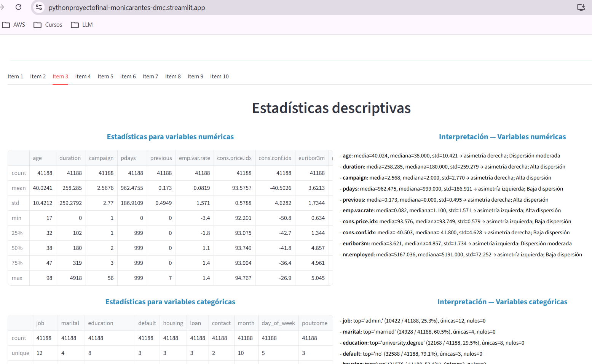

    
  - Ítem 4: Análisis de valores faltantes
 
    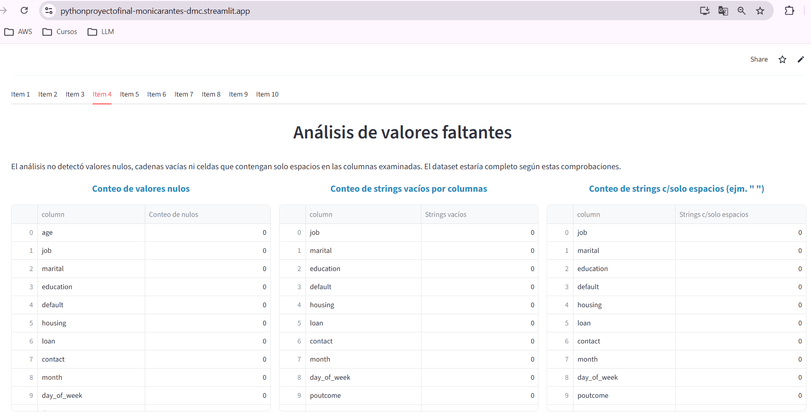

    
  - Ítem 5: Distribución de variables numéricas

    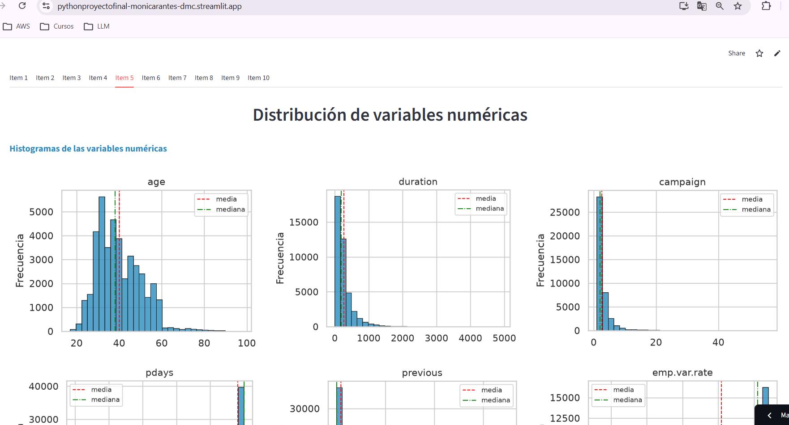

    
  - Ítem 6: Análisis de variables categóricas

    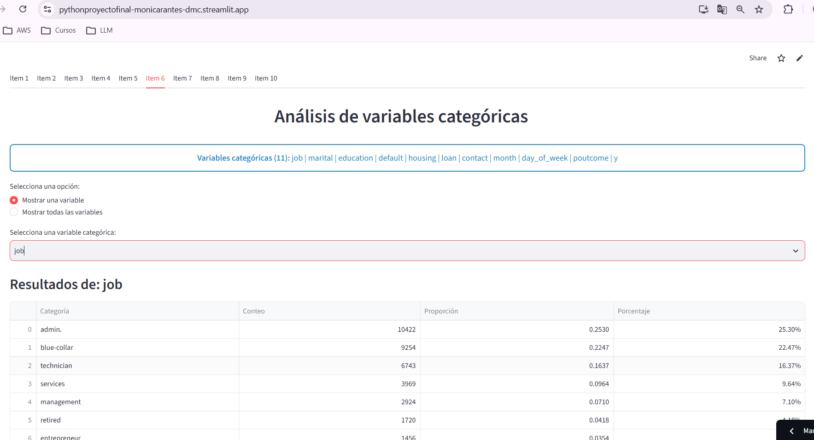

    
  - Ítem 7: Análisis bivariado (numérico vs categórico)
 
    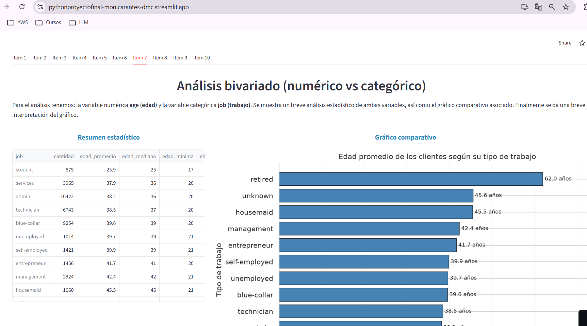

    
  - Ítem 8: Análisis bivariado (categórico vs categórico)

    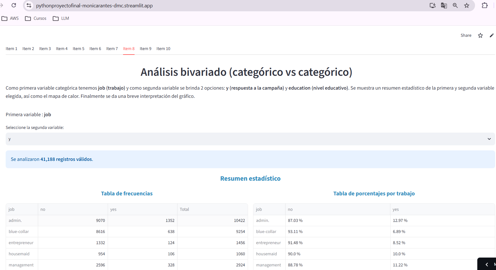

    
  - Ítem 9: Análisis basado en parámetros seleccionados
 
    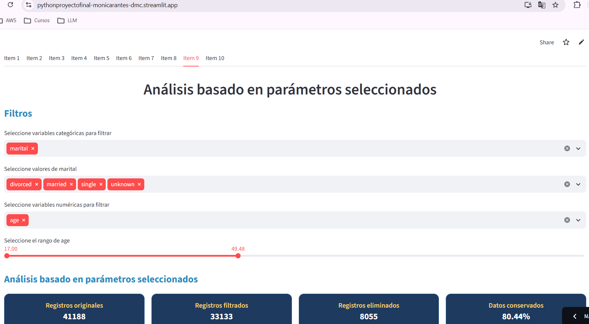

    
  - Ítem 10: Hallazgos clave
 
    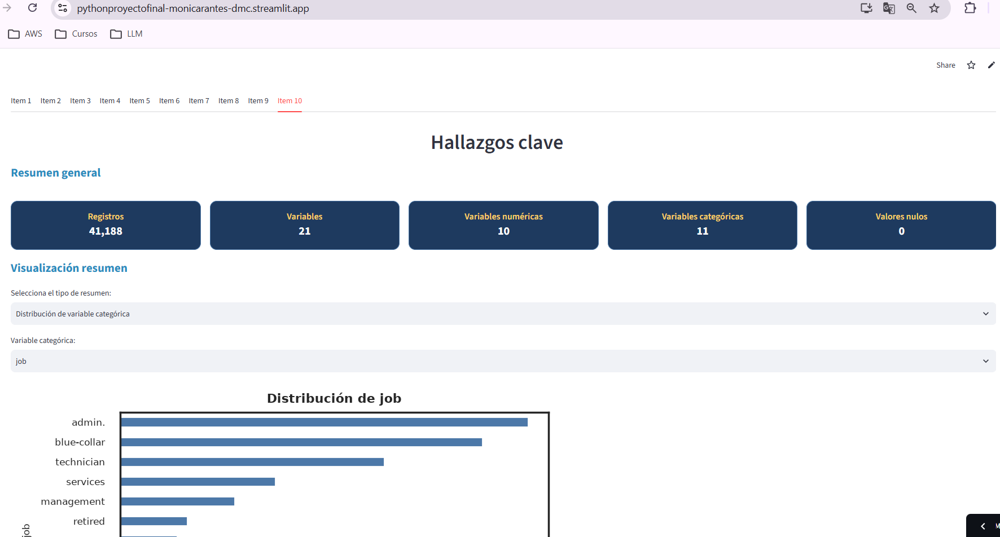

